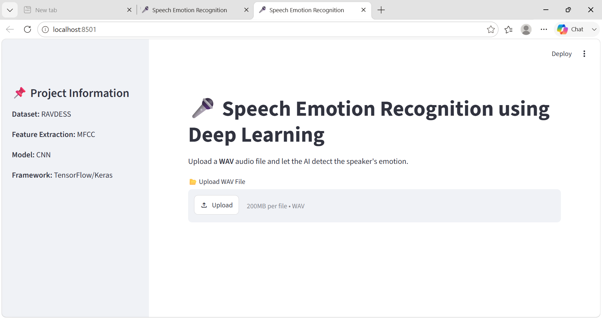
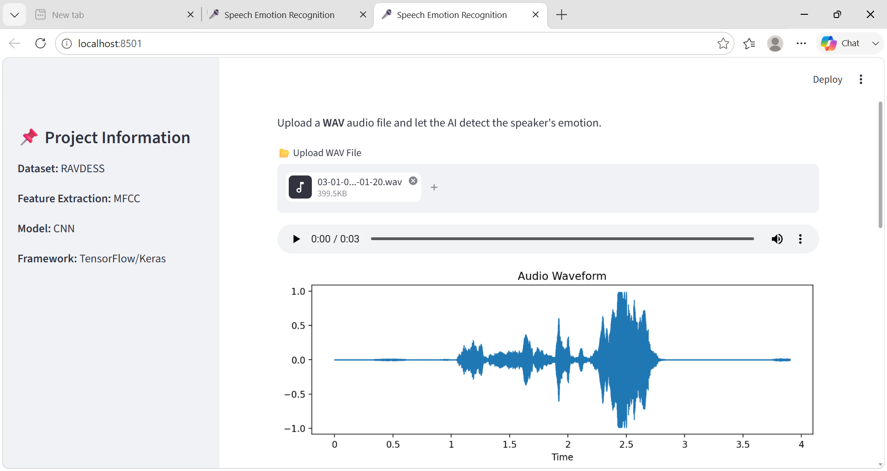
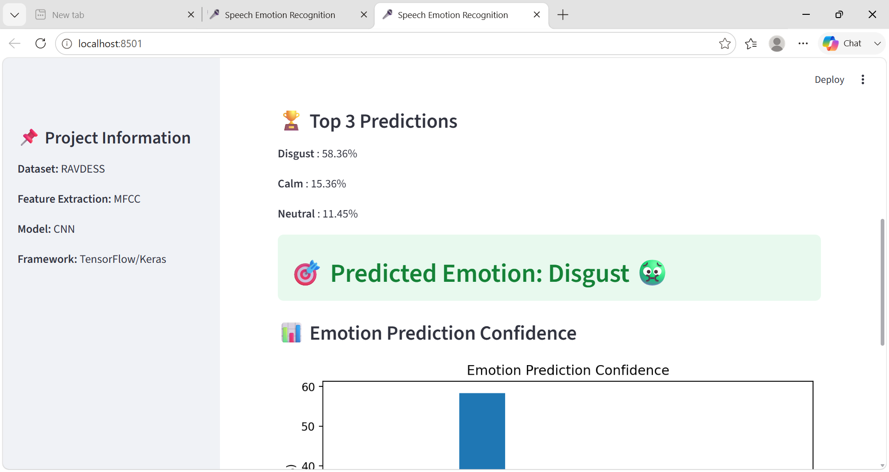
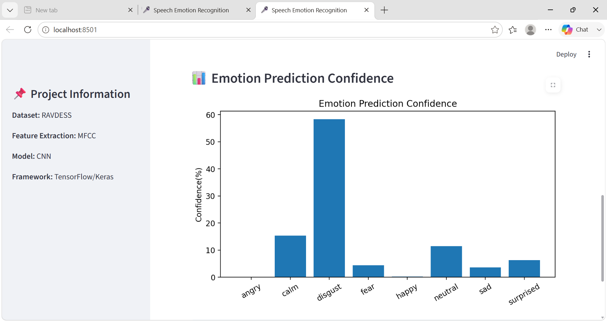
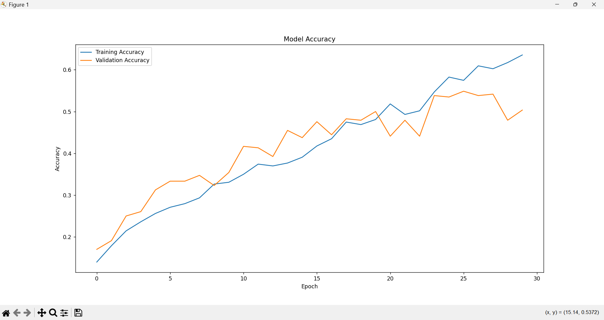
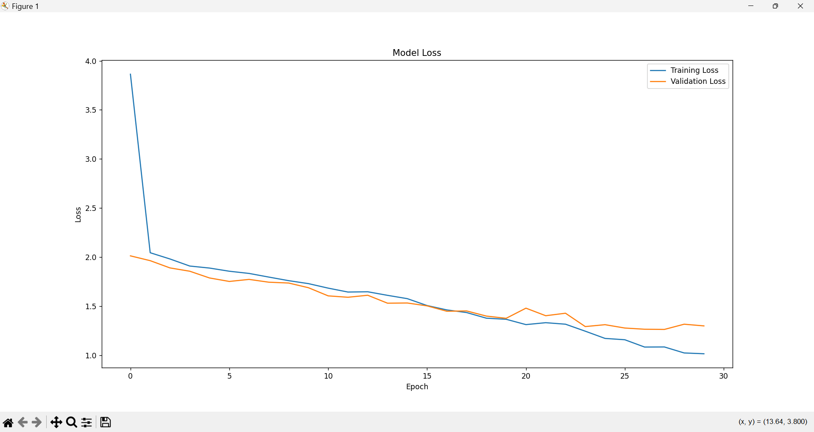
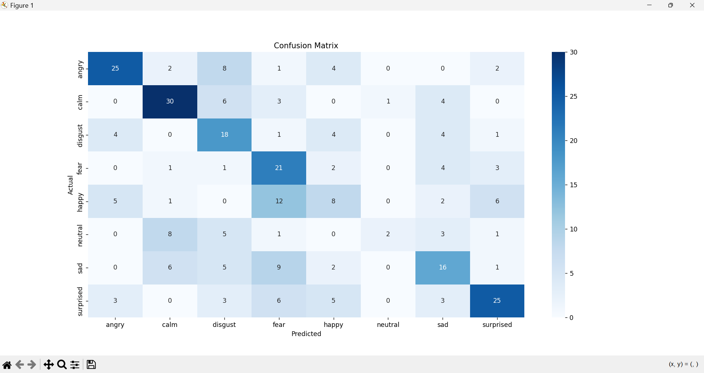

# 🎤 Speech Emotion Recognition using Deep Learning

A Deep Learning-based Speech Emotion Recognition system that predicts human emotions from speech audio using a CNN + LSTM hybrid architecture. The model captures both local spectral patterns (via CNN) and temporal dependencies (via LSTM) in MFCC feature sequences. The application is built with TensorFlow/Keras and deployed using Streamlit.

---

## 🚀 Features

- 🎵 Upload WAV audio files
- 🎯 Predicts 8 different emotions
- 🏆 Displays Top-3 predicted emotions
- 📊 Emotion confidence bar chart
- 🌊 Audio waveform visualization
- 🤖 CNN + LSTM hybrid Deep Learning model
- 💻 Interactive Streamlit Web App
- 📈 Training Accuracy & Loss visualization
- 📉 Confusion Matrix
- ⚡ Real-time emotion prediction

---

## 🧠 Predicted Emotions

- 😠 Angry
- 😌 Calm
- 🤢 Disgust
- 😨 Fear
- 😊 Happy
- 😐 Neutral
- 😢 Sad
- 😲 Surprised

---

## 🛠 Tech Stack

- Python
- TensorFlow / Keras
- Streamlit
- Librosa
- NumPy
- Pandas
- Matplotlib
- Seaborn
- Scikit-learn

---

## 📂 Dataset

**RAVDESS (Ryerson Audio-Visual Database of Emotional Speech and Song)**

- 1440 audio samples
- 24 professional actors (12 male, 12 female)
- 8 emotion classes per actor

---

## 🧩 Model Architecture

Instead of averaging MFCC features into a single vector, this project extracts a **time-series MFCC sequence** (130 time-steps × 40 coefficients) per audio clip, preserving temporal information.

- **Conv1D layers** — learn local spectral patterns within MFCC frames
- **LSTM layer** — learn temporal dependencies across time-steps (how emotion evolves over the utterance)
- **Dense + Dropout layers** — final classification with regularization

---

## 📁 Project Structure
<<<<<<< HEAD
=======

```
Emotion_Recognition_from_Speech_model/
│
├── dataset/
├── images/
│   ├── home.png
│   ├── waveform.png
│   ├── prediction_result.png
│   ├── prediction_confidence.png
│   ├── accuracy.png
│   ├── loss.png
│   └── confusion_matrix.png
│
├── feature_extraction.py
├── preprocess.py
├── train.py
├── model.py
├── test.py
├── app.py
├── emotion_data.csv
├── requirements.txt
├── README.md

```

---

## 📊 Model Performance

- Model : CNN + LSTM hybrid
- Number of Classes : 8
- Dataset : RAVDESS (1440 audio samples, 24 professional actors)
- Feature Extraction : MFCC (time-series sequence, 130 time-steps × 40 coefficients)
- Optimizer : Adam
- Loss Function : Sparse Categorical Crossentropy
- **Test Accuracy : 66%** (on 288 held-out test samples)
---

# 📷 Screenshots

## 🏠 Home Page



---

## Audio Waveform



---

## Emotion Prediction Result



---

## 📊 Emotion Prediction Confidence



---

## 📈 Training Accuracy



---

## 📉 Training Loss



---

## 📊 Confusion Matrix



---

## ▶️ Installation

Clone the repository

```bash
git clone https://github.com/Vanshika-ml/Emotion_Recognition_from_Speech_model.git
```

Move into project directory

```bash
cd Emotion_Recognition_from_Speech_model
```

Install dependencies

```bash
pip install -r requirements.txt
```

Run Streamlit App

```bash
streamlit run app.py
```

---

## 📌 Future Improvements

- Mel Spectrogram Visualization
- LSTM + CNN Hybrid Model
- Real-time Microphone Prediction
- Model Comparison
- Deployment on Streamlit Cloud
- Better UI/UX

---

## 👩‍💻 Author

**Vanshika Varshney**

GitHub:
https://github.com/Vanshika-ml

---

⭐ If you found this project useful, don't forget to star the repository.
>>>>>>> 257b8f3643dfe0730fdf12161f4348c52ee1e20e
